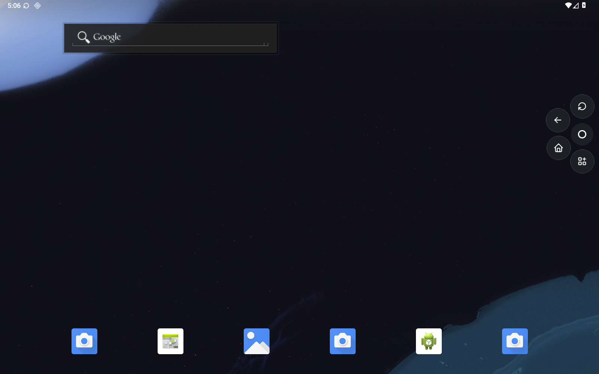
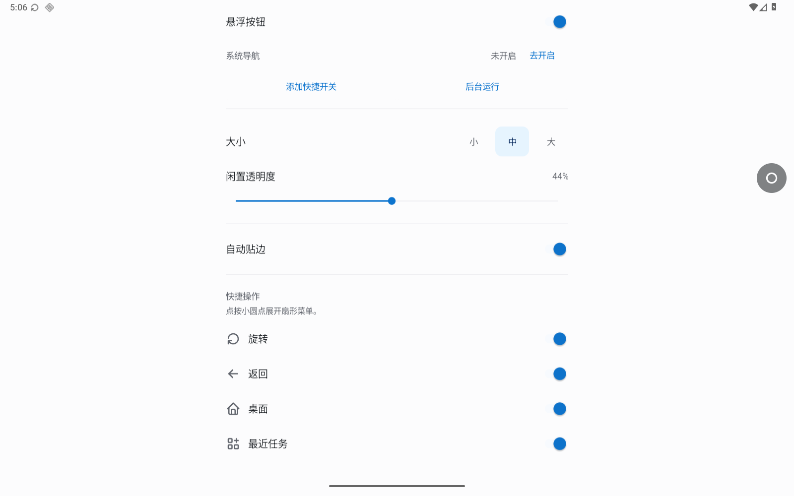

# Arotation

> 给 Android 平板用的手动横竖屏切换和系统快捷悬浮球。

很多平板默认开启自动旋转。平时它很方便，但在床上侧躺、半躺，或者只是拿平板的姿势变了一点，屏幕就可能突然转向。接下来往往只能反复打开、关闭自动旋转，打断正在做的事。

Arotation 把这件事变回手动：**横竖屏由你决定。** 而且平板屏幕大、横屏时离手指远，
返回、桌面、最近任务这些动作也能放在同一个小圆点里，随手就按得到。

关闭系统自动旋转后，在屏幕上保留一个小圆点。点一下，快捷操作按半圆扇形展开，点完立刻收回。
它自动贴边、闲置变淡，但从不自己消失——随手就能按到。

## 它能做什么

- **快捷操作**：旋转、返回、桌面、最近任务，四项按需选择；点小圆点展开扇形菜单。
- **一个固定的圆点标识**：桌面图标和悬浮点都是同一枚圆点，没有多余的换肤选项。
- **轻点切换横竖屏**：不需要打开设置，也不需要先唤醒按钮。
- **按住拖动**：把按钮放到顺手的位置。横屏和竖屏的位置会分别记住。
- **自动贴边和闲置渐隐**：不挡内容，也不会收起或隐藏。
- **入口不和操作打架**：悬浮按钮的长按不会跳到设置，设置从桌面图标、系统快捷开关或通知进入。

它不是另一个“更聪明的自动旋转器”，也不是方向锁定开关；它就是一个随时可按的手动控制。

旋转和桌面不需要任何额外权限。返回和最近任务通过一个最小的“系统导航”服务执行，需要你在系统无障碍设置里手动开启；
它只执行你点下的这一个动作：不读取屏幕内容、不截图、不注入手势。

## 开始使用

1. 从 [Releases](https://github.com/MindMobius/Arotation/releases/latest) 下载 APK。
2. 安装后允许“悬浮显示”和“修改系统设置”。
3. 打开 Arotation，开启“悬浮按钮”。
4. 在“快捷操作”里选择需要的动作；用到返回或最近任务时，按提示开启系统导航。
5. 轻点小圆点展开扇形菜单，按住它移动位置。

Arotation 面向 Android 16 及以上的平板。
`0.4.0` 使用新的个人项目包名 `de.xianmu.arotation`。如果你安装过旧预览版，它和当前版本是两个独立应用，需要重新授权。

## 给贡献者

README 只保留产品用途和使用方式。实现细节、设计约束、测试与发布流程放在 `docs/`：

- [架构与代码边界](docs/ARCHITECTURE.md)
- [设计与交互约束](docs/DESIGN.md)
- [测试说明](docs/TESTING.md)
- [签名与发布](docs/RELEASING.md)
- [0.5.0 验证记录](docs/releases/v0.5.0.md)
- [0.4.0 验证记录](docs/releases/v0.4.0.md)

源码使用 Java + Android SDK 原生 View，无第三方运行库。完整素材来源与许可见 [third_party/SOURCES.md](third_party/SOURCES.md)。

## 许可

代码采用 [MIT License](LICENSE)。
