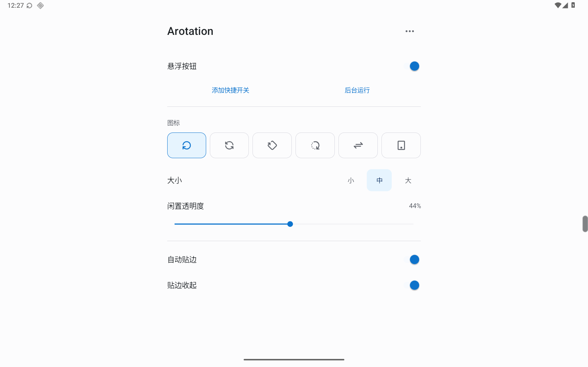

# Arotation

Android 平板上的手动旋转按钮。轻点切换横竖屏，按住拖动；不用时收在屏幕边缘。

[下载 APK](https://github.com/MindMobius/Arotation/releases/latest)

- Android 16 / API 36 及以上
- 包名：`de.xianmu.arotation`
- Java + Android SDK 原生 View，无第三方运行库
- 无联网、广告、统计、账号、无障碍服务或开机自启



## 使用

1. 安装后允许“悬浮显示”和“修改系统设置”，开启悬浮按钮。
2. 轻点旋转，按住拖动。长按不会进入设置，长按后松手也不会旋转。
3. 可开启“自动贴边”和“贴边收起”。收起后轻点仍直接旋转，不用先展开。
4. 需要设置时，打开桌面图标、长按系统快捷开关，或点击常驻通知中的“设置”。

从设置页可以添加系统快捷开关、选择六款图标、调整大小和闲置透明度。
后台运行入口会引导你修改应用的电池设置，不会自动关闭整个设备的省电模式。
正常停用后恢复先前的系统旋转设置；系统“强行停止”后，下次启动再尝试恢复。

`0.4.0` 开始使用个人项目的新包名，与之前的预览包是不同应用，需要重新授权。可先停用、卸载旧版，再安装本版。

## 权限

| 权限 | 用途 |
| --- | --- |
| 悬浮显示 | 在其他应用上方显示旋转按钮 |
| 修改系统设置 | 切换、锁定和恢复屏幕方向 |
| 前台服务 | 用户启用期间持续提供按钮 |
| 通知（可选） | 显示状态，提供设置和停用入口 |

没有后台位置、网络、传感器监听或唤醒锁。固定方向应用是否响应旋转取决于系统和应用本身。

## 构建

需要 JDK 17+、Android SDK 36、Build Tools 36.0.0。Gradle Wrapper 固定为 8.13，AGP 为 8.13.1。
配置 `ANDROID_HOME`，或用 Android Studio 打开项目并设置 SDK。

```sh
./gradlew :app:assembleDebug :app:assembleDebugAndroidTest :app:lintDebug
python scripts/check-core.py
python scripts/check-assets.py
```

Windows 使用 `gradlew.bat`。调试 APK 位于 `app/build/outputs/apk/debug/`。
调试签名与公开 Release 签名不同，不能用调试包覆盖已安装的正式包。

- [设备测试](docs/TESTING.md)
- [签名与发布](docs/RELEASING.md)
- [0.4.0 验证记录](docs/releases/v0.4.0.md)

## 目录

```text
app/                 Android 应用、资源和原生设备测试
  src/main/java/de/xianmu/arotation/
    data/            偏好与恢复日志
    rotation/        方向计算、系统设置写入与恢复
    overlay/         悬浮窗口、拖动与贴边收起
    ui/              配色、素材目录、后台引导
    system/          系统状态和设置入口
scripts/             构建、算法、素材与设备验收脚本
tests/               无 Android 依赖的 Java 算法测试
docs/                设计、架构、测试与发布说明
third_party/         素材原文件、固定来源和许可
gradle/wrapper/      固定版本的构建工具入口
.github/workflows/   构建、Lint 与静态检查
```

APK、构建缓存、本机 SDK 配置、模拟器文件和签名私钥不进入源码仓库。发布产物只上传到 GitHub Releases。

## 许可

代码采用 [MIT License](LICENSE)。
图标来自 Tabler Icons，配色来自 Radix Colors；均保留原始素材和 MIT 许可，未加入对应运行库。
详见 [素材来源](third_party/SOURCES.md)。
